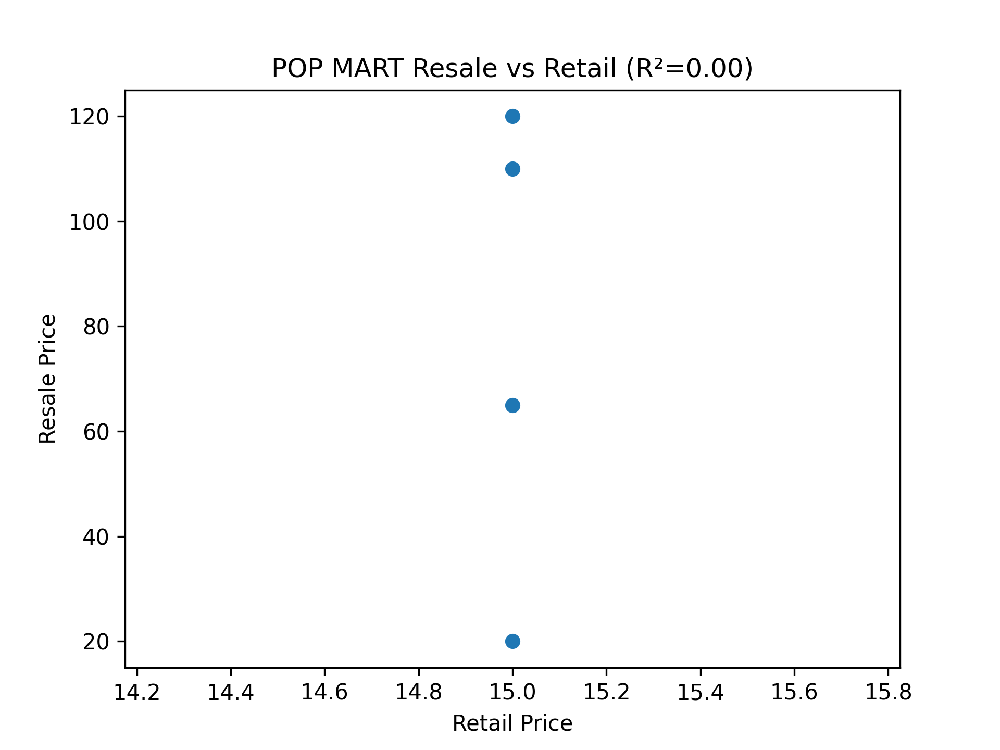
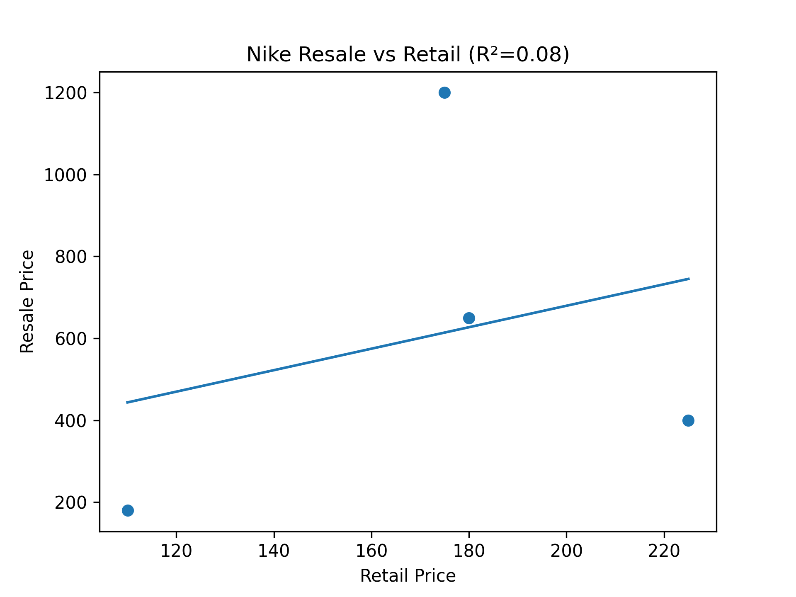

# Scarcity Pricing Analysis: POP MART vs Nike

## Overview
This project analyzes how scarcity affects resale pricing using regression analysis on POP MART collectibles and Nike sneakers.

## Dataset
- popmart_resale.csv
- nike_resale.csv

Data includes:
- Retail Price
- Resale Price

## Methodology
- Data cleaning with pandas
- Visualization with matplotlib
- Linear regression with scikit-learn
- R² correlation analysis

## Results

### POP MART
R² ≈ 0.00  
→ No correlation between retail and resale price  
→ Value driven by scarcity & hype

### Nike
R² ≈ 0.08  
→ Weak positive correlation  
→ Retail price slightly influences resale value

## Visualizations

## Tools Used
- Python
- Pandas
- Matplotlib
- Scikit-learn
- NumPy

## Key Insight
Scarcity plays a stronger role than retail pricing in collectible resale markets.

## Author
Tu Minh Dang
